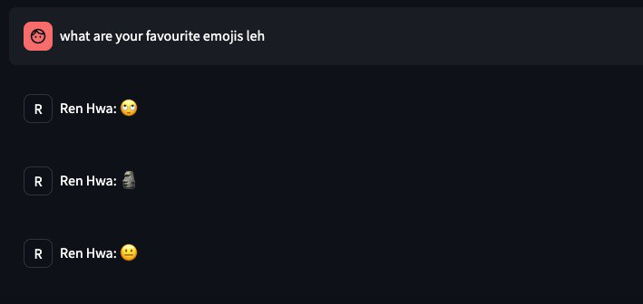
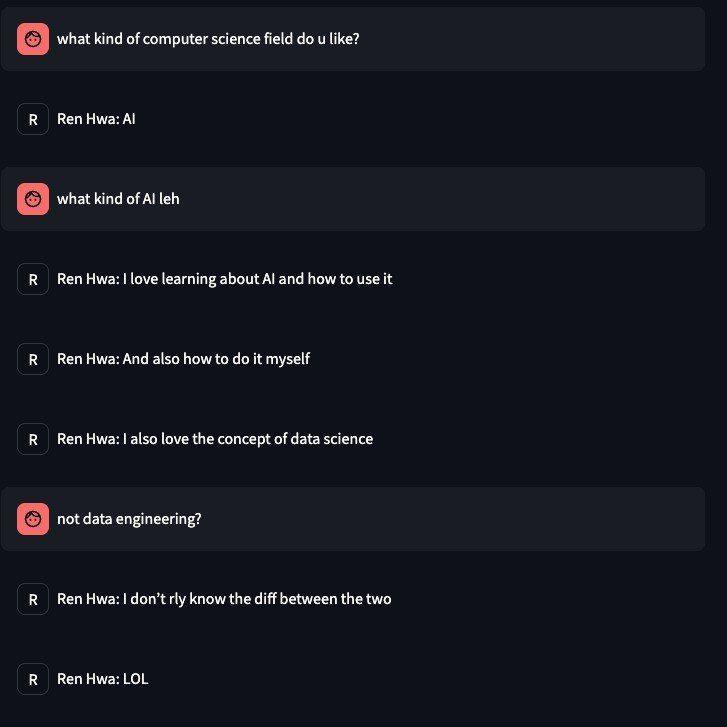
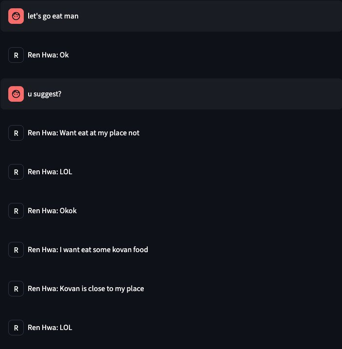

<a id="readme-top"></a>
<!-- PROJECT SHIELDS -->
[![Contributors][contributors-shield]][contributors-url]

<!-- PROJECT LOGO -->
<br />
<div align="center">
  <a href="https://github.com/shafiqninaba/resonare">
    
  </a>
<h2 align="center">Resonare</h2>

  <p align="center">
    End-to-end LLM Twin pipeline to make a clone of yourself based on your Telegram chat data.
    <br />
    <a href="https://github.com/shafiqninaba/resonare/issues/new?labels=bug&template=bug-report---.md">Report Bug</a>
    &middot;
    <a href="https://github.com/shafiqninaba/resonare/issues/new?labels=enhancement&template=feature-request---.md">Request Feature</a>
  </p>
</div>

<!-- TABLE OF CONTENTS -->
<details>
  <summary>Table of Contents</summary>
  <ol>
    <li>
    <a href="#built-with">Built With</a>
    </li>
    <li>
      <a href="#about-the-project">About The Project</a>
      <ul>
        <li><a href="#description">Description</a></li>
        <li><a href="#data-pipeline">Data Pipeline</a></li>
        <li><a href="#retrieval-and-question-answering-pipeline">Retrieval and Question Answering Pipeline</a></li>
      </ul>
    </li>
    <li>
      <a href="#getting-started">Getting Started</a>
      <ul>
        <li><a href="#prerequisites">Prerequisites</a></li>
        <li><a href="#installation-and-commands">Installation and Commands</a></li>
      </ul>
    </li>
    <li><a href="#usage">Usage</a></li>
    <li><a href="#demo">Demo</a></li>
    <li><a href="#contact">Contact</a></li>
  </ol>
</details>

## Built With

* [![Python][Python-img]][Python-url]
* [![uv][uv-img]][uv-url]
* <a href="https://github.com/unslothai/unsloth"></a>
* [![Streamlit][streamlit-img]][streamlit-url]
* <a href="https://aws.amazon.com/"></a>

<!-- ABOUT THE PROJECT -->
## About The Project

<div align="center">
  
</div>


### Description

Resonare is an end-to-end LLM Twin pipeline that allows you to create a clone of yourself based on your Telegram chat data. The application consists of three main components: Data-Prep, Fine-Tuning and a frontend interface for the user to upload their data and interact with the LLM Twin.

The motivation behind this project was to learn about fine-tuning LLMs and deploying the application on AWS EC2 with a GPU instance.

### Overview

#### Software Architecture
The diagram below shows the high-level architecture of the application.

<div align="center">
  
</div>


### Data-Prep

#### Software Architecture
The diagram below shows the high-level architecture of the application.


#### Key Components

- **FastAPI**: The API server that handles the requests from the client and manages the job queue.
- **Job Queue**: An in-memory queue that manages the jobs and ensures that the GPU is not overloaded with multiple jobs at the same time.
- **Async Worker**: A background worker that processes the jobs in the queue. It loads the JSON file, processes it and uploads the processed files to S3.
- **S3**: An AWS S3 bucket that stores the processed files. The raw JSON file is also uploaded to S3 for backup purposes.
- **Processing Pipeline**: The pipeline that processes the raw JSON file and generates the processed files. It includes steps such as loading the JSON file, chunking the chats into blocks, merging and sanitizing the data, computing statistics and exporting the processed files.
- **Statistics**: The statistics about the raw JSON file are computed and logged. This includes the number of blocks, tokens, messages, chats and users in the file.
- **Health Check**: The health check endpoint checks the status of the S3 bucket and the job queue. It returns the status of the S3 bucket and the number of jobs in the queue.

More information about the data pipeline can be found in this [`README.md`](packages/data-prep/README.md).

### Fine-Tuning

#### Software Architecture
The diagram below shows the high-level architecture of the application.


#### Key Components

- **FastAPI**: The API server that handles the requests from the client and manages the job queue.
- **Job Queue**: An in-memory queue that manages the jobs and ensures that the GPU is not overloaded with multiple jobs at the same time.
- **Async Worker**: A background worker that processes the jobs in the queue. It loads the JSON file, processes it and uploads the processed files to S3.
- **S3**: An AWS S3 bucket that stores the processed files. The raw JSON file is also uploaded to S3 for backup purposes.
- **Fine-Tuning Pipeline**: The pipeline that fine-tunes the LLM on the processed data. It includes steps such as loading the model, training the model and uploading the model to S3.
- **Inference Pipeline**: The pipeline that generates the response from the LLM Twin. It includes steps such as loading the model, generating the response and returning the response to the client.
- **Health Check**: The health check endpoint checks the status of the S3 bucket and the job queue. It returns the status of the S3 bucket and the number of jobs in the queue.
- **Unsloth**: Unsloth is used for fine-tuning the LLM. It allows models to be fine tuned on lesser GPU compute resources.

<p align="right">(<a href="#readme-top">back to top</a>)</p>

<!-- DEMO -->
## Demo

The gifs below showcase the key features of the application and showing it in action.

### Uploading and Processing Data

<div align="center">
   <p><em>Figure 1: Uploading and Processing Data</em></p>
</div>

The gif above shows the user uploading a JSON file containing their Telegram chat data. The file is then processed and the user can monitor the job status in real-time in the Job Monitor tab. The processed data is stored in an S3 bucket.

<div align="center">
   <p><em>Figure 2: Some statitics about the raw Telegram data</em></p>
</div>

The user can also see some statistics about the raw Telegram data, such as the number of blocks, tokens etc. This is useful for the user to understand the data they are working with.

### Checking Job Queue

<div align="center">
   <p><em>Figure 3: Job Queue</em></p>
</div>

When another user uploads a file, the job is added to the queue. This is so that the GPU will not be overloaded with multiple jobs at the same time. The user can check the queue status in the Job Monitor tab. The job queue is managed by a in memory queue.

### Chatting with the LLM Twin

<div align="center">
   <p><em>Figure 4: Chatting with the LLM Twin</em></p>
</div>

The gif above shows the user chatting with their LLM Twin. The user can ask questions and the LLM Twin will respond with a style similar to user's messaging style.

Below are some more examples of the conversations with the LLM Twin. Note that the LLM Twin picked up on the user's Singlish and the way they type. The LLM Twin also has some information about the user, such as their favourite emojis and their favourite field in computer science.

<details>
  <summary>Favourite emojis</summary>

  <div align="center">
     <p><em>Figure 5: What are your favourite emojis?</em></p>
  </div>

</details>

<details>
  <summary>Favourite field in computer science</summary>

  <div align="center">
     <p><em>Figure 6: What is your favourite field in computer science?</em></p>
  </div>

</details>

<details>
  <summary>Want to eat?</summary>

  <div align="center">
     <p><em>Figure 7: Want to eat?</em></p>
  </div>
  
</details>

<p align="right">(<a href="#readme-top">back to top</a>)</p>

<!-- GETTING STARTED -->
## Getting Started

To get a local copy up and running follow these simple steps.

### Prerequisites

- [Python](https://www.python.org/) 3.8 or higher
- [uv](https://docs.astral.sh/uv/) package manager
- [Docker](https://www.docker.com/) to run the application locally
- [AWS Account](https://aws.amazon.com/) to store the crawled data in an S3 bucket

### Installation and Commands

1. Clone the repository:
```bash
git clone https://github.com/shafiqninaba/resonare.git
cd resonare
```

2. Create an .env file in the root directory and add the following environment variables:
```
AWS_ACCESS_KEY_ID=XXXXXXXX
AWS_SECRET_ACCESS_KEY=YYYYYYYYYYYYYYYY
AWS_S3_BUCKET=resonare-test-bucket
AWS_REGION=ap-southeast-1
# HUGGINGFACE_USERNAME=
# HUGGINGFACE_TOKEN=
```
_**Note:** The `HUGGINGFACE_USERNAME` and `HUGGINGFACE_TOKEN` are optional. If used,the fine tuned model will be uploaded to your Hugging Face account._

3. Build and run the docker compose file:
```bash
docker-compose up --build
```

4. Open your browser and go to `http://localhost:8501` to access the web app.


5. Close the web app and stop the docker container:
```bash
docker-compose down
```

<p align="right">(<a href="#readme-top">back to top</a>)</p>

<!-- CONTACT -->
## Contact

<a href="https://github.com/shafiqninaba/resonare/graphs/contributors">
  
</a>

Shafiq Ninaba | shafiqninaba@gmail.com | [LinkedIn](https://linkedin.com/in/shafiq-ninaba)

Zack Low | lowrenhwa88@gmail.com | [LinkedIn](https://www.linkedin.com/in/ren-hwa-low-855080224/)

<p align="right">(<a href="#readme-top">back to top</a>)</p>

<!-- MARKDOWN LINKS & IMAGES -->
<!-- https://www.markdownguide.org/basic-syntax/#reference-style-links -->
[contributors-shield]: https://img.shields.io/github/contributors/shafiqninaba/resonare.svg?style=for-the-badge
[contributors-url]: https://github.com/shafiqninaba/resonare/graphs/contributors
[forks-shield]: https://img.shields.io/github/forks/shafiqninaba/resonare.svg?style=for-the-badge
[forks-url]: https://github.com/shafiqninaba/resonare/network/members
[stars-shield]: https://img.shields.io/github/stars/shafiqninaba/resonare.svg?style=for-the-badge
[stars-url]: https://github.com/shafiqninaba/resonare/stargazers
[issues-shield]: https://img.shields.io/github/issues/shafiqninaba/resonare.svg?style=for-the-badge
[issues-url]: https://github.com/shafiqninaba/resonare/issues
[linkedin-shield]: https://img.shields.io/badge/-LinkedIn-black.svg?style=for-the-badge&logo=linkedin&colorB=555
[product-screenshot]: assets/images/main_screenshot.jpg
[Python-img]: https://img.shields.io/badge/python-3670A0?style=for-the-badge&logo=python&logoColor=ffdd54
[Python-url]: https://www.python.org/
[uv-img]: https://img.shields.io/badge/uv-package%20manager-blueviolet
[uv-url]: https://docs.astral.sh/uv/
[streamlit-img]: https://img.shields.io/badge/-Streamlit-FF4B4B?style=flat&logo=streamlit&logoColor=white
[streamlit-url]: https://streamlit.io/

