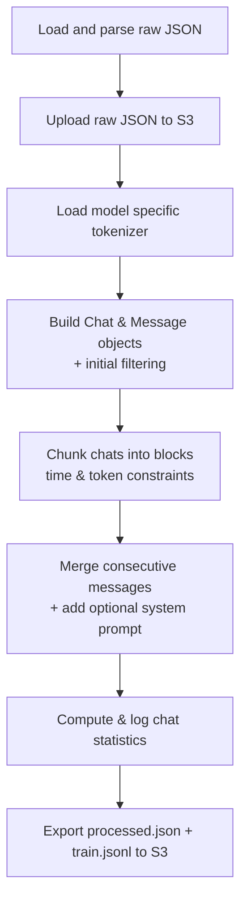

# Resonare Data Prep

This module is designed to process telegram JSON chat exports into structured, token-bounded conversation blocks ready for LLM fine-tuning.

## Table of Contents
1.  [Processing Pipeline](#processing-pipeline)
    *   [Processing Steps](#processing-steps)
    *   [Input and Output Formats](#input-and-output-formats)
    *   [Chunking Strategy](#chunking-strategy)
2.  [Architecture](#architecture)
    *   [FastAPI + Async Worker Flow](#fastapi--async-worker-flow)
    *   [Process Flow Description](#process-flow-description)
3.  [Getting Started](#getting-started)
    *   [Prerequisites](#prerequisites)
    *   [Preparing Input Data](#preparing-input-data)
    *   [Installation](#installation)
    *   [Configuration](#configuration)
    *   [Running the Application](#running-the-application)
4.  [API Reference](#api-reference)
5.  [Examples](#examples)

## Processing Pipeline

The processing pipeline consists of several steps designed to transform raw chat data into clean, properly formatted training examples:



### Processing Steps

1.  **Load and Parse Raw JSON**: Loads raw JSON from a temp file created by the API, validates the structure, extracts chat data, and deletes the temp file.
2.  **Upload Raw JSON to S3**: (If `s3` in `output.modes`) Saves the validated raw chat list (`<run_id>/data/raw.json`) to the configured S3 bucket for backup and auditing.
3.  **Load Model-Specific Tokenizer**: Loads the tokenizer specified by `cfg.model_id` (e.g., `meta-llama/Llama-3.2-1B`) using Hugging Face’s `transformers.AutoTokenizer`. This ensures accurate token counting for chunking, consistent with the target fine-tuning model. Falls back to OpenAI's `tiktoken` if the specific tokenizer is unavailable or for speed.
4.  **Build Chat & Message Objects**: Transforms raw chat data into internal `Chat` and `Message` Python objects.
    *   **Filtering**: Skips chats without names, non-`personal_chat` types, messages without sender/text content (`text_entities` or `sticker_emoji`), and messages older than `cfg.date_limit` (if set). Cleans message text (strips whitespace, replaces internal newlines).
    *   **Structure**: Assigns `user`/`assistant` roles based on whether the sender matches `cfg.target_name`. Sorts messages chronologically within each `Chat`.

    *Internal `Chat.messages` Structure (Conceptual JSON):*
    ```json
    [
      {"role": "assistant", "content": "Hey!", "timestamp": "...T10:00:00Z"},
      {"role": "user", "content": "Hi Ren", "timestamp": "...T10:00:30Z"},
      {"role": "user", "content": "How's it going?", "timestamp": "...T10:01:00Z"}
    ]
    ```

5.  **Chunk Chats into Blocks**: Segments each `Chat.messages` list into `blocks`. A block represents a temporally and contextually coherent segment of conversation.
    *   **Rules**: A new block starts if the time gap between consecutive messages exceeds `cfg.convo_block_threshold_secs` OR adding the next message would exceed `cfg.max_tokens_per_block`.
    *   **Validation**: Final blocks are kept only if their total token count is between `cfg.min_tokens_per_block` and `cfg.max_tokens_per_block`. Chats yielding no valid blocks are discarded.

    *Internal `Chat.blocks` Structure (Conceptual JSON):*
    ```json
    [
      // Block 1
      [
        {"role": "assistant", "content": "Hey!", "timestamp": "...T10:00:00Z"},
        {"role": "user", "content": "Hi Ren", "timestamp": "...T10:00:30Z"},
        {"role": "user", "content": "How's it going?", "timestamp": "...T10:01:00Z"}
      ],
      // Block 2 (starts due to time gap > threshold)
      [
        {"role": "assistant", "content": "Later...", "timestamp": "...T14:00:00Z"},
        {"role": "user", "content": "You free?", "timestamp": "...T14:00:20Z"}
      ]
    ]
    ```

6.  **Merge Consecutive Messages & Add System Prompt**: Refines each block into the final training format.
    *   **Merging**: Joins consecutive messages *from the same role* within a block into a single `Message`. The `content` lines are prefixed with `cfg.message_delimiter` (e.g., `>>>`) and separated by `\n` to preserve the multi-message flow. The `timestamp` of the first message in the merged sequence is kept.
    *   **System Prompt**: If `cfg.system_prompt` is set, a `{"role": "system", "content": cfg.system_prompt}` message is prepended to the start of *every* block.

    *Output Structure (Single block -> one line in `train.jsonl`):*
    ```json
    {
      "messages": [
        {"role": "system", "content": "You are Ren Hwa."},
        {"role": "assistant", "content": ">>> Hey!"},
        {"role": "user", "content": ">>> Hi Ren\n>>> How's it going?"}
      ]
    }
    ```

7.  **Compute & Log Chat Statistics**: Calculates and logs summary statistics (total chats processed, total blocks generated, min/max/avg tokens per block, min/max/avg duration per block, top chats by block count).
8.  **Export Processed Files**: Saves the final results based on `output.modes`:
    *   **`processed.json`**: Contains the full list of processed `Chat` objects, including metadata and the final list of `blocks` for each chat. Saved to `output.local_dir` and/or S3 (`<run_id>/data/processed.json`).
    *   **`train.jsonl`**: Contains one processed block per line, formatted for LLM fine-tuning. Saved to `output.local_dir` and/or S3 (`<run_id>/data/train.jsonl`).

### Input and Output Formats

#### Input Options

The system accepts a single JSON payload via the `/data-prep/process` API endpoint. The payload structure should match one of these formats derived from a Telegram export:

1.  **List of Single-Chat Dictionaries**:
    ```json
    [
      {"name":"Alice","messages":[...]},
      {"name":"Bob","messages":[...]}
    ]
    ```

2.  **Telegram Export Object (`result.json` structure)**:
    ```json
    {"chats":{"list":[
      {"name":"Alice","messages":[...]},
      {"name":"Bob","messages":[...]}
    ]}}
    ```

3.  **Single-Chat Dictionary**:
    ```json
    {"name":"Alice","messages":[...]}
    ```

#### Output Formats

The processing module produces two primary output files per run, saved locally and/or to S3:

1.  **`processed.json`**: A comprehensive JSON file containing full metadata for each processed chat, along with the structured list of conversation blocks (`messages` list for each block). Useful for inspection and analysis.
2.  **`train.jsonl`**: A JSON Lines file, optimized for fine-tuning. Each line contains a single conversation block formatted as a JSON object with a `messages` key, as shown in Step 6 above.

*Example `train.jsonl` Line:*
```json
{"messages": [{"role": "system", "content": "You are Ren Hwa, a kind, sensitive and somewhat bubbly guy."}, {"role": "assistant", "content": ">>> Eh dude\n>>> What's your advice for me ah …"}, {"role": "user", "content": ">>> wah u have CNY though …"}]}
```

### Chunking Strategy

Chunking creates meaningful training examples by balancing context preservation with model input constraints.

1.  **Temporal Continuity**: Messages are grouped into a block only if the time gap between consecutive messages is within `cfg.convo_block_threshold_secs`. This maintains conversational flow.
2.  **Token Budget Control**: Each final block must have a token count between `cfg.min_tokens_per_block` and `cfg.max_tokens_per_block`, ensuring sufficient context without exceeding limits.

## Architecture

The application uses FastAPI with an asynchronous background worker for non-blocking, potentially long-running data processing tasks.

### FastAPI + Async Worker Flow

```mermaid
flowchart TD
    subgraph Client
        A[User POSTs JSON to <br/> /data-prep/process]
    end

    subgraph FastAPI App API Server
        A --> B[Parse JSON + Write temp file];
        B --> C[Generate run_id<br/>Store initial job_status];
        C --> D[Enqueue run_id<br/>to background job_queue];
        D --> R[Return run_id to Client];
    end

    subgraph Async Worker (Background Process)
        E[Dequeue run_id from job_queue];
        E --> F[Load JSON from temp file];
        F --> G[Execute Processing Pipeline, Steps 1-8];
        G --> H[Update job_status, COMPLETED/FAILED];
        H --> I[Write processed files, local/S3];
    end

    D ==> E; # Queue link
```

### Process Flow Description

1.  **Client Submission**: User sends JSON data via POST to `/data-prep/process`.
2.  **FastAPI Handling**: The API server quickly validates the request, saves the JSON to a temporary file, generates a unique `run_id`, records the job as `QUEUED`, adds the `run_id` to an internal queue, and immediately returns the `run_id` to the client.
3.  **Async Processing**: A separate background worker process picks up the `run_id` from the queue, retrieves the corresponding temporary file, executes the entire data processing pipeline (Steps 1-8), updates the job status (to `RUNNING`, then `COMPLETED` or `FAILED`), and handles saving the output files.

This architecture ensures the API remains responsive and can handle multiple processing requests concurrently (processed sequentially by the worker).

## Getting Started

This section guides you through setting up and running the Resonare Data Prep module.

### Prerequisites

*   **Python 3.8+**: Ensure a compatible Python version is installed.
*   **Git**: Required to clone the repository.
*   **`uv` (Recommended)**: A fast Python package installer and resolver. Installation: [uv Getting Started](https://docs.astral.sh/uv/getting-started/installation/)
*   **Docker (Optional)**: For running in a container. Installation: [Docker Engine Install](https://docs.docker.com/engine/install/)
*   **Telegram Chat Export**: You need your chat data exported from Telegram in JSON format.

### Preparing Input Data

Before running the application, prepare your Telegram JSON export:

1.  **Export from Telegram**: Use Telegram Desktop to export your chat data. Choose JSON format. You can export individual chats or all chats at once.
2.  **Place the Data**:
    *   **Single File Export (`result.json`)**: If you exported all chats into one file (commonly named `result.json`), place this file in a location accessible to the application, for example, `./data/raw/result.json`.
    *   **Multiple File Export (Directory)**: If you exported chats individually, they will likely be in a directory containing multiple JSON files. Place this entire directory in an accessible location, for example, `./data/raw/chats/`.
3.  **Configure Input Path**: The application reads the input path from the configuration file (`conf/config.yaml`). By default, it expects the data in `./data/raw/`. If you placed your data elsewhere, **update the `input.file` or `input.dir` path in `conf/config.yaml` accordingly**. Also, ensure `input.mode` is set correctly ("file" or "dir").

### Installation

1.  **Clone the Repository**:
    ```bash
    git clone git@github.com:shafiqninaba/resonare.git
    cd resonare/packages/data-prep
    ```

2.  **Set up Python Environment & Dependencies**: Choose **one** method:

    **Method A: `uv` (Recommended)**
    *   Install `uv` globally if needed: `pip install uv`
    *   Sync environment and dependencies:
        ```bash
        # Creates .venv and installs packages from pyproject.toml/requirements.lock
        uv sync
        ```

    **Method B: Manual `venv`**
    *   Create environment: `python3 -m venv .venv`
    *   Activate: `source .venv/bin/activate` (Linux/macOS)
    *   Install dependencies: `pip install -r requirements.txt`

### Configuration

Before running, review and adjust settings in `conf/config.yaml`:

*   **`input`**: Ensure `mode`, `file`, and `dir` match your prepared data setup.
*   **`target_name`**: Set this to your exact name as it appears in the Telegram chats.
*   **`system_prompt`**: Customize the system prompt for your fine-tuning task.
*   **`output.modes`**: Choose where to save results (`local`, `s3`, or both).
*   **S3 Settings (If using `s3` output mode)**:
    *   Update `output.s3_bucket` and `output.s3_region` with your details.
    *   **AWS Credentials**: Ensure the environment where you run the application has valid AWS credentials configured. Common methods include:
        *   Setting environment variables: `AWS_ACCESS_KEY_ID`, `AWS_SECRET_ACCESS_KEY`, `AWS_SESSION_TOKEN` (if using temporary credentials).
        *   Using an AWS credentials file (`~/.aws/credentials`).
        *   Using IAM roles (e.g., on EC2 instances or ECS tasks).
        The application uses `boto3`, which automatically searches for credentials in this standard order.

### Running the Application

Choose the method that best suits your needs:

#### 1. Direct Python Execution (Development)

*   **Using `uv`:**
    ```bash
    uv run python main.py
    ```
*   **Using manual `venv`:** (Ensure activated: `source .venv/bin/activate`)
    ```bash
    python main.py
    ```

#### 2. Docker Container (Production / Isolated Environment)

*   **Build:**
    ```bash
    docker build --platform linux/amd64 -t resonare/data-prep:latest .
    ```
*   **Run:**
    ```bash
    # Define AWS credentials as environment variables for the container if using S3
    docker run --rm -it \
      -e AWS_ACCESS_KEY_ID="YOUR_KEY" \
      -e AWS_SECRET_ACCESS_KEY="YOUR_SECRET" \
      # -e AWS_SESSION_TOKEN="YOUR_TOKEN" # If applicable
      -v $(pwd)/data:/app/data \
      -v $(pwd)/conf:/app/conf \
      -p 8010:8010 \
      resonare/data-prep:latest \
      uv run python main.py
    ```
    *   **Volume Mounts (`-v`)**:
        *   `-v $(pwd)/data:/app/data`: Maps your local `./data` directory (containing `raw` and for `processed` output) to `/app/data` inside the container. The default `config.yaml` paths (`./data/...`) will *not* work correctly inside Docker unless mapped like this. If you map volumes, ensure your `config.yaml` uses paths *relative to the container's filesystem*, e.g., `/app/data/raw/result.json`, `/app/data/processed/`. **It's often easier to mount the config file itself (`-v $(pwd)/conf:/app/conf`) and keep the relative paths in the config as they are (`./data/...`) because the working directory inside the container is usually `/app`.**
        *   `-v $(pwd)/conf:/app/conf`: Mounts your local configuration directory, allowing you to modify `config.yaml` on the host without rebuilding the image.
    *   **AWS Credentials (`-e`)**: Pass credentials securely as environment variables if using S3 output. Avoid hardcoding them. Consider more secure methods like IAM roles for production.

#### 3. Uvicorn / FastAPI CLI (Alternative Development Servers)

*   **Uvicorn:** (Provides auto-reload)
    ```bash
    # Using uv
    uv run uvicorn app:app --host 0.0.0.0 --port 8014 --reload

*   **FastAPI CLI:** (Requires `fastapi[standard]`)
    ```bash
    # Using uv
    # uv add "fastapi[standard]" # If needed
    # uv run fastapi dev app:app --host 0.0.0.0 --port 8016
    ```
---

Once started, the API server is typically available at `http://localhost:8010`.

## API Reference

| Route                          | Method | Description                                                        | Example Response Body (JSON)                                                                   |
| :----------------------------- | :----- | :----------------------------------------------------------------- | :--------------------------------------------------------------------------------------------- |
| `/data-prep/process`           | POST   | Submits JSON payload for processing.                             | `{ "status": "queued", "message": "Job accepted...", "run_id": "<uuid>" }`                       |
| `/data-prep/jobs/{run_id}`     | GET    | Retrieves status and metadata for a specific job (`JobInfo`).      | `{ "run_id": "<uuid>", "status": "COMPLETED", "position_in_queue": 0, "created_at": "...", ...}` |
| `/data-prep/jobs`              | GET    | Retrieves status and metadata for *all* known jobs.                | `{ "<run_id_1>": { ...JobInfo... }, "<run_id_2>": { ...JobInfo... } }`                          |
| `/data-prep/system/queue`      | GET    | Retrieves current queue status, size, and all job statuses.        | `{ "running": false, "queue_size": 0, "jobs": { "<run_id>": { ...JobInfo... } } }`             |
| `/data-prep/system/health`     | GET    | Basic health check including S3 connectivity status.               | `{ "status": "healthy", "s3": "connected" }` or `{ "status": "healthy", "s3": "missing" }`      |

*(Note: `JobInfo` contains fields like `run_id`, `status`, `position_in_queue`, `created_at`, `updated_at`, `error_message` etc.)*

## Examples

### Example cURL Commands

```bash
# 1) Submit a raw JSON file (e.g., merged.json) for processing
#    (Ensure merged.json exists and contains valid Telegram export data)
curl -X POST -H "Content-Type: application/json" \
     --data @merged.json \
     http://localhost:8010/data-prep/process

curl -X POST -H "Content-Type: application/json" \
     --data @/Users/lowrenhwa/Desktop/resonare/packages/data-prep/data/raw/result.json \
     http://localhost:8015/data-prep/process
# Example Response: {"status": "queued", "message": "Job accepted and enqueued", "run_id": "a1b2c3d4-e5f6-7890-abcd-ef0123456789"}

# 2) Check the status of a specific job using the run_id
RUN_ID="a1b2c3d4-e5f6-7890-abcd-ef0123456789" # Replace with your actual run_id
curl http://localhost:8015/data-prep/jobs/${RUN_ID}
# Example Response (Completed Job):
# {
#  "run_id": "a1b2c3d4-e5f6-7890-abcd-ef0123456789",
#  "status": "COMPLETED",
#  "position_in_queue": 0,
#  "created_at": "2023-10-27T10:30:00.123456",
#  "updated_at": "2023-10-27T10:35:00.987654",
#  "error_message": null
# }

# 3) View the status of ALL jobs
curl http://localhost:8015/data-prep/jobs
# Example Response:
# {
#   "a1b2c3d4-e5f6-7890-abcd-ef0123456789": { "run_id": "...", "status": "COMPLETED", ... },
#   "fgh1i2j3-k4l5-6789-mnop-qr0123456789": { "run_id": "...", "status": "FAILED", "error_message": "...", ... }
# }

# 4) Get system queue information
curl http://localhost:8015/data-prep/system/queue
# Example Response (Idle system):
# {
#   "running": false,
#   "queue_size": 0,
#   "jobs": {
#     "a1b2c3d4-e5f6-7890-abcd-ef0123456789": { "run_id": "...", "status": "COMPLETED", ... }
#   }
# }

# 5) Perform a health check
curl http://localhost:8015/data-prep/system/health
# Example Response (Healthy, S3 connected): {"status": "healthy", "s3": "connected"}
# Example Response (Healthy, S3 missing/not configured): {"status": "healthy", "s3": "missing"}