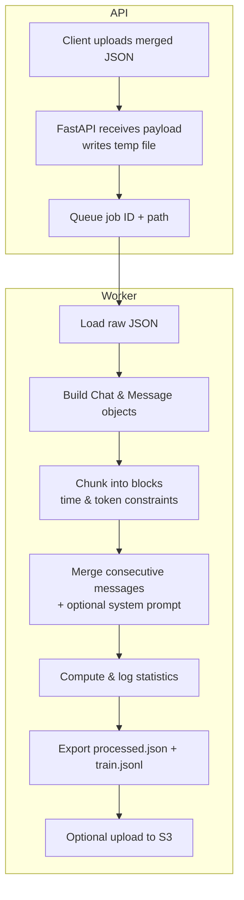

````markdown
# Resonare Data Prep

Transforms Telegram-style JSON chat exports into clean, token-bounded conversation blocks suitable for LLM fine-tuning.

---

## Workflow Overview



flowchart TD
    subgraph Client
        A[User uploads JSON<br/> POST /data-prep/process]
    end

    subgraph FastAPI App
        A --> B[Parse JSON + Write temp file]
        B --> C[Generate run_id<br/>Store in job_status]
        C --> D[Enqueue run_id<br/>job_queue.put-run_id]
    end

    subgraph Async Worker
        E[Wait for run_id from job_queue]
        E --> F[Load JSON from temp file]
        F --> G[run_data_processing in background thread]
        G --> H[Write processed files + update status]
    end

    D --> E

A: Client sends application/json, either a list or a Telegram-style {"chats": {"list": [...]}}.

B: FastAPI writes this payload into /tmp/chat_data_prep/<run_id>.json.

C: A run_id is generated and stored in job_status, tracking position and timestamps.

D: Job is queued in job_queue.

E: Background async task (_worker()) listens on job_queue.

F: Worker loads the JSON from the file path.

G: Heavy lifting happens here: building objects, chunking blocks, writing outputs.

H: Job is marked COMPLETED or FAILED, queue proceeds to next job.

---

## Chunking Strategy

1. **Temporal continuity**
   Messages are grouped only if the interval between them is no more than `convo_block_threshold_secs` (e.g. 3600 s). This prevents mixing distinct conversations.

2. **Token budget**
   Each block must contain between `min_tokens_per_block` and `max_tokens_per_block` tokens. We count tokens via a tokenizer to ensure that blocks:

   * Aren’t too short to give useful context
   * Don’t exceed model input limits

---

## Tokenizer Selection

* **Primary**: load the tokenizer matching your `model_id` (Hugging Face BPE, SentencePiece, WordPiece, etc.) for accurate token counts.
* **Fallback**: use OpenAI’s TikToken (BPE) for speed and broad compatibility.

---

## Input → Output

* **Input**: a single JSON payload, which may be:

  1. A **list** of single-chat dicts:

     ```json
     [
       {"name":"Alice","messages":[…]},
       {"name":"Bob","messages":[…]}
     ]
     ```
  2. A **Telegram export** object:

     ```json
     {"chats":{"list":[ … ]}}
     ```
  3. One single-chat dict:

     ```json
     {"name":"Alice","messages":[…]}
     ```

* **Output**:

  * `processed.json` – full chat metadata + blocks
  * `train.jsonl`  – one block per line, ready for training

### `train.jsonl` format

```json
{
  "messages": [
    {
      "role": "system",
      "content": "You are Ren Hwa, a kind, sensitive and somewhat bubbly guy."
    },
    {
      "role": "assistant",
      "content": ">>> Eh dude\n>>> What’s your advice for me ah …"
    },
    {
      "role": "user",
      "content": ">>> wah u have CNY though …"
    }
  ]
}
```

---

## Running the Service

### 1. Pure Python (development)

The `uv` tool manages a per-project virtual environment and dependencies:

1. Install `uv`:

   ```bash
   pip install uv
   ```
2. Declare runtime requirements:

   ```bash
   uv add fastapi --extra standard uvicorn
   ```
3. Install dependencies into the project venv:

   ```bash
   uv sync
   ```
4. Launch the server:

   ```bash
   uv run main.py         # uses the shebang in main.py
   ```

Alternatively, run Uvicorn directly if you prefer:

```bash
uvicorn app:app --host 0.0.0.0 --port 8010 --reload
```

### 2. Docker

1. **Build** (example for amd64):

   ```bash
   docker build --platform linux/amd64 -t data-prep:0.0.1 .
   ```
2. **Run**, mounting your local `data` directory:

   ```bash
   docker run --rm -it \
     -v $(pwd)/data:/app/data \
     -p 8010:8010 \
     data-prep:0.0.1 \
     uv run main.py
   ```

### 3. FastAPI CLI (optional)

If you have installed with the FastAPI “standard” extras:

```bash
uv add fastapi --extra standard
uv run fastapi dev app:app --host 0.0.0.0 --port 8010
```

or simply:

```bash
fastapi dev app:app --host 0.0.0.0 --port 8010
```

---

## API Endpoints

| Route                        | Method | Description                                               |
| ---------------------------- | ------ | --------------------------------------------------------- |
| `/data-prep/process`         | POST   | Submit a JSON payload; returns `{ "run_id": "<uuid>" }`   |
| `/data-prep/{run_id}/status` | GET    | Get status: `QUEUED`, `RUNNING`, `COMPLETED`, or `FAILED` |
| `/data-prep/queue`           | GET    | Snapshot of all jobs in queue                             |
| `/data-prep/health`          | GET    | Health check and S3 connectivity                          |

### Example cURL

```bash
# 1) Submit merged JSON
curl -X POST -H "Content-Type: application/json" \
     --data @merged.json \
     http://localhost:8010/data-prep/process

# 2) Check job status
curl http://localhost:8010/data-prep/<run_id>/status

# 3) View queue
curl http://localhost:8010/data-prep/queue

# 4) Health check
curl http://localhost:8010/data-prep/health
```
